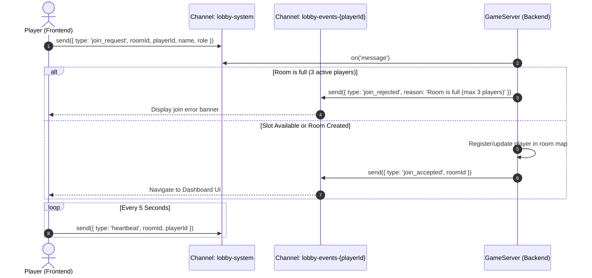
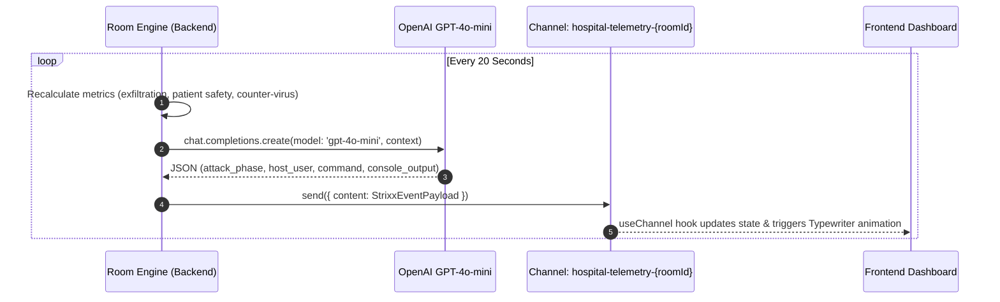
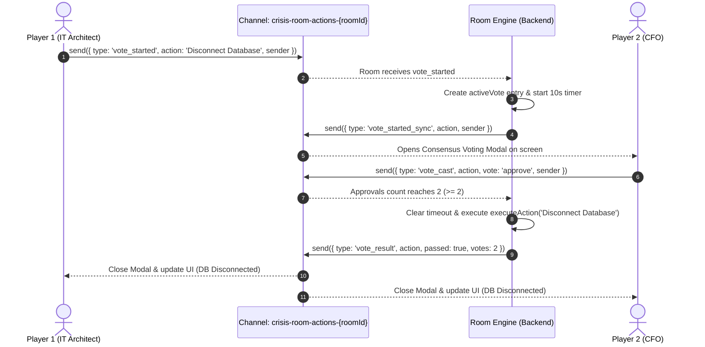
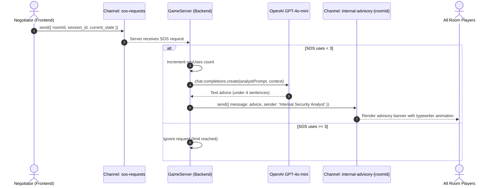
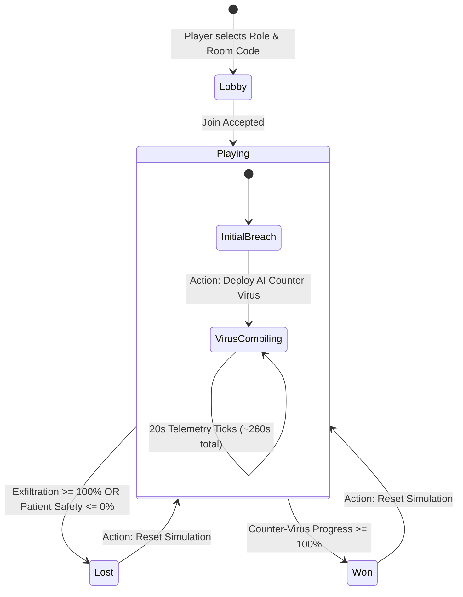

# 📐 System Architecture & Event Payload Specification

This document provides a deep technical breakdown of **Nocturnal StrixX - Crisis Room Simulator**, detailing event sequence flows, state machines, channel taxonomy, and JSON schemas for all real-time communications powered by the **Portal SDK**.

---

## 📌 Table of Contents

- [Channel Taxonomy](#-channel-taxonomy)
- [Sequence Diagrams](#-sequence-diagrams)
  - [1. Player Room Join & Validation Flow](#1-player-room-join--validation-flow)
  - [2. Attacker Telemetry Tick Flow](#2-attacker-telemetry-tick-flow)
  - [3. "Double Key" Consensus Voting Flow](#3-double-key-consensus-voting-flow)
  - [4. Negotiator SOS Emergency Request Flow](#4-negotiator-sos-emergency-request-flow)
- [Game State Machine](#-game-state-machine)
- [JSON Channel Event Payload Schemas](#-json-channel-event-payload-schemas)

---

## 📡 Channel Taxonomy

All real-time communications use **Portal SDK** channels. Channels are isolated either globally or per-room:

```
GLOBAL CHANNELS
├── lobby-system                   # Broadcast/Listen for join requests & heartbeats
├── sos-requests                   # Global channel listening for Negotiator SOS calls
└── lobby-events-{playerId}        # Direct feedback channel for a specific joining player

ROOM-SPECIFIC CHANNELS (Dynamic per roomId, e.g., SALA1)
├── hospital-telemetry-{roomId}     # Attacker terminal logs, game metrics & countdowns
├── crisis-room-actions-{roomId}   # Consensus voting events (vote_started, vote_cast, vote_result)
├── crisis-room-cursors-{roomId}   # Real-time player cursor position tracking (x, y, role)
└── internal-advisory-{roomId}     # Broadcast channel for AI Crisis Analyst advice text
```

---

## ⏱️ Sequence Diagrams

### 1. Player Room Join & Validation Flow



---

### 2. Attacker Telemetry Tick Flow



---

### 3. "Double Key" Consensus Voting Flow



---

### 4. Negotiator SOS Emergency Request Flow



---

## 🔄 Game State Machine



---

## 📋 JSON Channel Event Payload Schemas

### 1. `hospital-telemetry-{roomId}` Payload

```json
{
  "attack_phase": "Lateral Movement - Active Directory Breach",
  "attacker_terminal": {
    "host_user": "strixx@c2-server:~#",
    "executed_command": "mimikatz.exe sekurlsa::logonpasswords",
    "console_output": "[+] Extracting domain credentials... NT hash recovered."
  },
  "server_status": "Critical",
  "exfiltration_progress": 42,
  "patient_safety": 85,
  "counter_virus_progress": 15,
  "game_status": "PLAYING",
  "game_session_id": "1723178945123",
  "sos_uses_left": 2,
  "is_database_disconnected": false,
  "is_icu_offline": false,
  "impact_metrics": {
    "stolen_records": 48200,
    "compromised_systems": 18
  },
  "emergency_funds": 250000,
  "active_vote": null
}
```

### 2. `crisis-room-actions-{roomId}` Vote Request Payload

```json
{
  "type": "vote_started",
  "action": "Disconnect Database",
  "sender": "Agent_Smith",
  "isSoloPlayer": false,
  "session_id": "1723178945123"
}
```

### 3. `crisis-room-cursors-{roomId}` Cursor Payload

```json
{
  "id": "Agent_Smith",
  "name": "Agent_Smith",
  "role": "IT Architect",
  "x": 1240,
  "y": 680
}
```

### 4. `internal-advisory-{roomId}` Advisory Payload

```json
{
  "id": "1723179001234",
  "timestamp": "2026-08-08T21:47:10.000Z",
  "message": "Bosses, the exfiltration is too high! You need to press [Disconnect Database] NOW. We will assume the operational cost, but it's better than a massive leak.",
  "sender": "Internal Security Analyst"
}
```

---

## 🔗 Related Documentation

- 🏠 [Root README](file:///home/chelo/antigravity/PortalHack/hackathon-portal/README.md)
- 💻 [Frontend Technical Documentation](file:///home/chelo/antigravity/PortalHack/hackathon-portal/frontend/README.md)
- ⚙️ [Backend Technical Documentation](file:///home/chelo/antigravity/PortalHack/hackathon-portal/backend/README.md)
- 🛠️ [Terraform AWS Infrastructure Guide](file:///home/chelo/antigravity/PortalHack/hackathon-portal/terraform/README.md)
