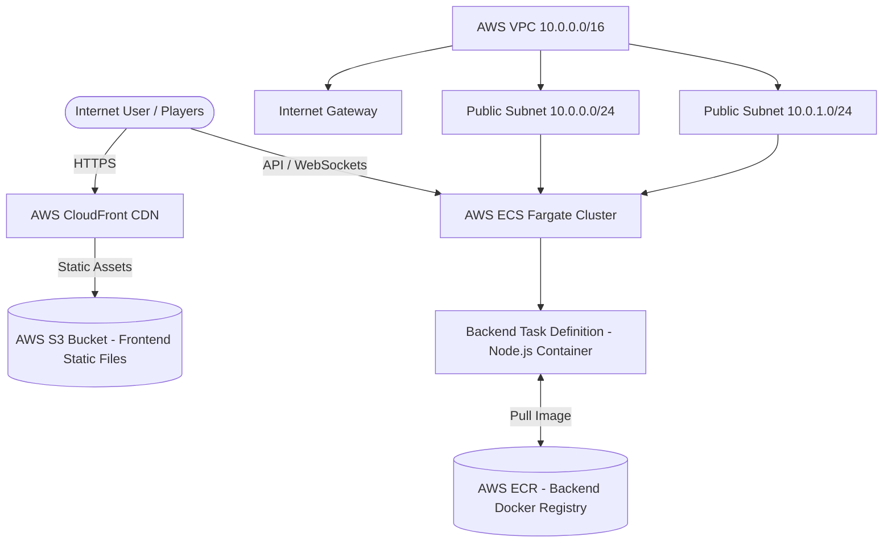

# 🛠️ AWS Infrastructure via Terraform

This directory contains the complete **Infrastructure as Code (IaC)** configuration written in HCL (HashiCorp Configuration Language) to deploy the **Nocturnal StrixX Hackathon Portal** to AWS using **ECS Fargate**, **AWS ECR**, **AWS S3**, and **AWS CloudFront CDN**.

---

## 🏗️ Architecture Overview



### Components Breakdown
- **Network**: VPC with CIDR `10.0.0.0/16`, Internet Gateway, and 2 Public Subnets across Availability Zones for high availability.
- **Backend Infrastructure**:
  - AWS ECR repository (`hackathon-portal-backend`) for storing Docker container images.
  - AWS ECS Fargate Cluster & Task Definition (0.25 vCPU, 512MB RAM) running the Node.js backend.
  - CloudWatch Log Group (`/ecs/hackathon-portal-backend`) for container log stream inspection.
  - Security Group allowing inbound HTTP traffic on port `8080`.
- **Frontend Infrastructure**:
  - AWS S3 bucket configured with static web hosting and private OAC/policy.
  - AWS CloudFront distribution providing global edge caching, HTTP to HTTPS redirection, and custom SSL endpoints.

---

## 📁 File Structure

```
terraform/
├── cloudfront.tf           # S3 bucket, CloudFront distribution, and bucket policy
├── ecr.tf                  # AWS ECR repository definition
├── ecs.tf                  # ECS Cluster, Task Definition, Service, and IAM Execution Role
├── main.tf                 # Terraform provider, VPC, Internet Gateway, Subnets & Route Tables
├── outputs.tf              # Terraform deployment outputs (ECR URL, S3 Bucket, CloudFront URL)
├── security.tf             # ECS Security Group rules
├── variables.tf            # Configurable Terraform input variables
└── README.md               # Infrastructure deployment documentation
```

---

## 📋 Prerequisites

1. **Terraform**: v1.5.0 or later installed (`terraform -v`).
2. **AWS CLI**: Installed and configured with appropriate deployment credentials (`aws configure`).
3. **Docker**: Local Docker daemon running to build and push container images.
4. **pnpm / Node.js**: Installed to build frontend assets prior to uploading to S3.

---

## 🚀 Step-by-Step Deployment Walkthrough

### Step 1: Initialize and Apply Terraform

1. Navigate to the `terraform` directory:
   ```bash
   cd hackathon-portal/terraform
   ```
2. Initialize Terraform modules and providers:
   ```bash
   terraform init
   ```
3. Preview and apply the infrastructure provisioning:
   ```bash
   terraform apply -auto-approve
   ```
4. Note the output values printed upon completion:
   - `backend_repository_url`: ECR repository URI
   - `frontend_bucket_name`: AWS S3 bucket name
   - `cloudfront_domain_name`: Public HTTPS CloudFront domain URL

---

### Step 2: Build and Push Backend Container to ECR

1. Authenticate Docker with your AWS ECR registry:
   ```bash
   aws ecr get-login-password --region us-east-1 | docker login --username AWS --password-stdin <YOUR_AWS_ACCOUNT_ID>.dkr.ecr.us-east-1.amazonaws.com
   ```
2. Navigate to the `backend` directory:
   ```bash
   cd ../backend
   ```
3. Build the Docker container image:
   ```bash
   docker build -t hackathon-portal-backend .
   ```
4. Tag and push the image to ECR:
   ```bash
   docker tag hackathon-portal-backend:latest <backend_repository_url>:latest
   docker push <backend_repository_url>:latest
   ```
5. Force an ECS service deployment to pick up the new image:
   ```bash
   aws ecs update-service --cluster hackathon-portal-cluster --service backend-service --force-new-deployment
   ```

---

### Step 3: Build and Upload Frontend to AWS S3

1. Navigate to the `frontend` directory:
   ```bash
   cd ../frontend
   ```
2. Set environment variables and compile the production bundle:
   ```bash
   pnpm install
   VITE_PORTAL_API_KEY="pk_your_portal_key" pnpm run build
   ```
3. Synchronize the `dist` folder directly to the provisioned AWS S3 bucket:
   ```bash
   aws s3 sync dist/ s3://<frontend_bucket_name> --delete
   ```
4. (Optional) Invalidate CloudFront edge cache:
   ```bash
   aws cloudfront create-invalidation --distribution-id <YOUR_DISTRIBUTION_ID> --paths "/*"
   ```

---

### Step 4: Access the Application

Open `https://<cloudfront_domain_name>` in your browser to access the live deployed portal!

---

## 🧹 Cleanup & Teardown

To destroy all AWS provisioned resources and avoid recurring charges:

```bash
# Empty S3 bucket before destroy
aws s3 rm s3://<frontend_bucket_name> --recursive

# Destroy Terraform infrastructure
cd terraform
terraform destroy -auto-approve
```

---

## 🔗 Related Documentation

- 🏠 [Root README](file:///home/chelo/antigravity/PortalHack/hackathon-portal/README.md)
- 💻 [Frontend Documentation](file:///home/chelo/antigravity/PortalHack/hackathon-portal/frontend/README.md)
- ⚙️ [Backend Documentation](file:///home/chelo/antigravity/PortalHack/hackathon-portal/backend/README.md)
- 📐 [Architecture & Event Schemas](file:///home/chelo/antigravity/PortalHack/hackathon-portal/docs/ARCHITECTURE.md)
